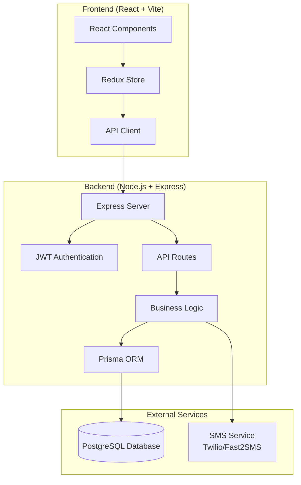
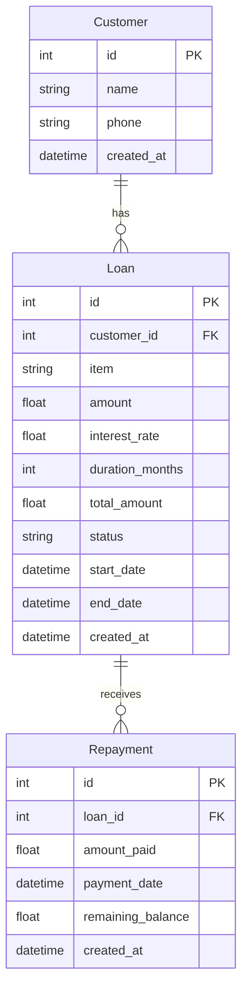

# Design Document: Database Integration & Backend Setup

## Overview

This design transforms the existing loan management system from a DynamoDB-based AWS Lambda architecture to a PostgreSQL-based traditional server architecture with enhanced features. The system will maintain the existing React frontend while completely rebuilding the backend to use PostgreSQL with Prisma ORM, hosted on cloud platforms like Supabase or Neon.tech.

The design addresses the migration from the current AWS Lambda + DynamoDB setup to a more traditional Node.js + Express + PostgreSQL stack while adding new features like SMS notifications, enhanced UI/UX, and real-time dashboard updates.

## Architecture

### High-Level Architecture



### Database Architecture

The PostgreSQL database will replace the current DynamoDB tables with a relational structure:



## Components and Interfaces

### Backend Components

#### 1. Database Layer (Prisma ORM)
- **Purpose**: Data access and database operations
- **Technology**: Prisma ORM with PostgreSQL
- **Responsibilities**:
  - Database schema management
  - Type-safe database queries
  - Migration management
  - Connection pooling

#### 2. API Layer (Express.js)
- **Purpose**: HTTP request handling and routing
- **Technology**: Express.js with TypeScript
- **Responsibilities**:
  - Route definition and handling
  - Request validation
  - Response formatting
  - CORS configuration
  - Error handling middleware

#### 3. Service Layer
- **Purpose**: Business logic implementation
- **Components**:
  - `CustomerService`: Customer management operations
  - `LoanService`: Loan creation, calculation, and status management
  - `RepaymentService`: Payment processing and balance updates
  - `NotificationService`: SMS notification handling
  - `DashboardService`: Statistics aggregation

#### 4. Authentication Layer
- **Purpose**: User authentication and authorization
- **Technology**: JWT tokens with bcrypt password hashing
- **Responsibilities**:
  - User login/logout
  - Token generation and validation
  - Password encryption
  - Route protection

### Frontend Components (Enhanced)

#### 1. API Client Enhancement
- **Purpose**: Replace mock data with real API calls
- **Technology**: Axios HTTP client
- **Responsibilities**:
  - HTTP request management
  - Error handling
  - Response transformation
  - Authentication token management

#### 2. UI/UX Enhancements
- **Components**:
  - `PasswordToggle`: Eye icon for password visibility
  - `CurrencyDisplay`: Rupee symbol formatting
  - `AnimatedTransitions`: Framer Motion animations
  - `LoadingStates`: API call loading indicators

#### 3. Dashboard Enhancement
- **Purpose**: Real-time statistics display
- **Responsibilities**:
  - Live data fetching
  - Statistics calculation display
  - Auto-refresh functionality

## Data Models

### Prisma Schema Definition

```prisma
model Customer {
  id          Int       @id @default(autoincrement())
  name        String
  phone       String
  created_at  DateTime  @default(now())
  loans       Loan[]
}

model Loan {
  id              Int       @id @default(autoincrement())
  customer_id     Int
  item            String
  amount          Float
  interest_rate   Float     @default(3.0)
  duration_months Int
  total_amount    Float
  status          String    @default("Active")
  start_date      DateTime
  end_date        DateTime?
  created_at      DateTime  @default(now())
  repayments      Repayment[]
  customer        Customer  @relation(fields: [customer_id], references: [id])
}

model Repayment {
  id                Int       @id @default(autoincrement())
  loan_id           Int
  amount_paid       Float
  payment_date      DateTime  @default(now())
  remaining_balance Float
  created_at        DateTime  @default(now())
  loan              Loan      @relation(fields: [loan_id], references: [id])
}
```

### API Data Transfer Objects

```typescript
// Customer DTOs
interface CreateCustomerDTO {
  name: string;
  phone: string;
}

interface CustomerResponseDTO {
  id: number;
  name: string;
  phone: string;
  created_at: string;
  loans?: LoanResponseDTO[];
}

// Loan DTOs
interface CreateLoanDTO {
  customer_id: number;
  item: string;
  amount: number;
  interest_rate?: number;
  duration_months: number;
  start_date: string;
}

interface LoanResponseDTO {
  id: number;
  customer_id: number;
  item: string;
  amount: number;
  interest_rate: number;
  duration_months: number;
  total_amount: number;
  status: string;
  start_date: string;
  end_date: string | null;
  created_at: string;
  customer?: CustomerResponseDTO;
  repayments?: RepaymentResponseDTO[];
}

// Repayment DTOs
interface CreateRepaymentDTO {
  loan_id: number;
  amount_paid: number;
  payment_date?: string;
}

interface RepaymentResponseDTO {
  id: number;
  loan_id: number;
  amount_paid: number;
  payment_date: string;
  remaining_balance: number;
  created_at: string;
}

// Dashboard DTOs
interface DashboardStatsDTO {
  active_loans_count: number;
  total_customers_count: number;
  total_principal_amount: number;
}
```

## Error Handling

### Backend Error Handling Strategy

1. **Validation Errors**: Use Zod for request validation with detailed error messages
2. **Database Errors**: Prisma error handling with user-friendly messages
3. **Business Logic Errors**: Custom error classes for domain-specific errors
4. **HTTP Error Responses**: Standardized error response format

```typescript
interface ErrorResponse {
  success: false;
  error: {
    code: string;
    message: string;
    details?: any;
  };
  timestamp: string;
}
```

### Frontend Error Handling

1. **API Error Handling**: Axios interceptors for global error handling
2. **User Feedback**: Toast notifications for error states
3. **Fallback UI**: Error boundaries for component-level errors
4. **Retry Logic**: Automatic retry for transient failures

## Testing Strategy

### Backend Testing

1. **Unit Tests**: Service layer business logic testing
2. **Integration Tests**: API endpoint testing with test database
3. **Database Tests**: Prisma model and query testing
4. **SMS Integration Tests**: Mock SMS service testing

### Frontend Testing

1. **Component Tests**: React component behavior testing
2. **API Integration Tests**: Mock API response testing
3. **User Flow Tests**: End-to-end user interaction testing
4. **Animation Tests**: Framer Motion animation testing

### Test Data Management

1. **Database Seeding**: Test data setup for development and testing
2. **Mock Services**: SMS service mocking for testing
3. **Test Isolation**: Database cleanup between tests
4. **Environment Separation**: Separate test database configuration

## Security Considerations

### Authentication & Authorization
- JWT token-based authentication
- Secure password hashing with bcrypt
- Token expiration and refresh strategy
- Route-level authorization middleware

### Data Protection
- Input validation and sanitization
- SQL injection prevention through Prisma
- CORS configuration for frontend access
- Environment variable protection for secrets

### SMS Security
- API key protection for SMS services
- Rate limiting for SMS notifications
- Phone number validation and formatting

## Performance Considerations

### Database Optimization
- Database indexing for frequently queried fields
- Connection pooling for concurrent requests
- Query optimization for dashboard statistics
- Database migration strategy

### API Performance
- Response caching for dashboard statistics
- Pagination for large data sets
- Compression middleware for responses
- Request rate limiting

### Frontend Performance
- Lazy loading for components
- Optimized bundle size
- Animation performance optimization
- API response caching

## Deployment Architecture

### Backend Deployment
- **Platform**: Render, Railway, or similar Node.js hosting
- **Database**: Supabase or Neon.tech PostgreSQL hosting
- **Environment**: Production environment variables
- **Monitoring**: Application performance monitoring

### Frontend Deployment
- **Platform**: Vercel, Netlify, or similar static hosting
- **Build**: Optimized production build
- **Environment**: Production API endpoints
- **CDN**: Global content delivery

### CI/CD Pipeline
- **Source Control**: Git-based deployment triggers
- **Testing**: Automated test execution
- **Database Migrations**: Automated schema updates
- **Environment Promotion**: Staging to production workflow